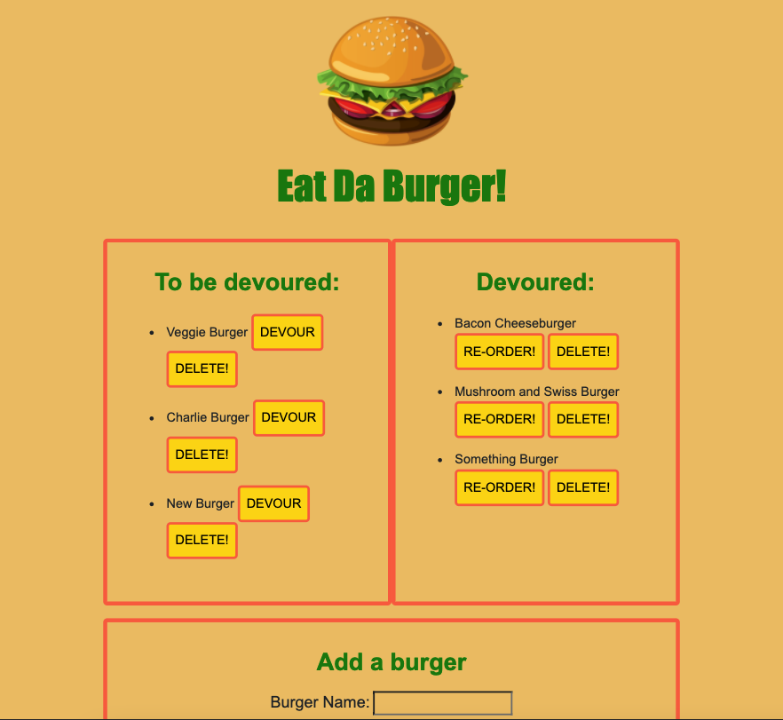

# Eat Da Burger!

## Description

Hungry? Decide what burger you would like to devour...

## Table of Contents

- [Installation](#installation)
- [Usage](#usage)
- [Questions](#questions)
- [License](#license)

## Installation

Simply open the deployed Heroku application to begin!

## Usage

- Users may select the `DEVOUR` buttons from burgers in the 'To Be Devoured' column, which will send the burger they're craving to the 'Devoured' section.
- From there, if a user wishes to re-order the same burger for another round, they may do so by clicking the `RE-ORDER IT!` button.
- If a user would like to devour a burger not yet on the list, they may use the `'Add Burger'` form section to do so.
- At any given time, should a user become disgusted with a burger in either list, they may delete it using any of the attached `DELETE` buttons.

## Questions

If you have any questions, please contact jimbopulos at james.mgalantino@gmail.com

## License

This application is covered under the MIT license.
