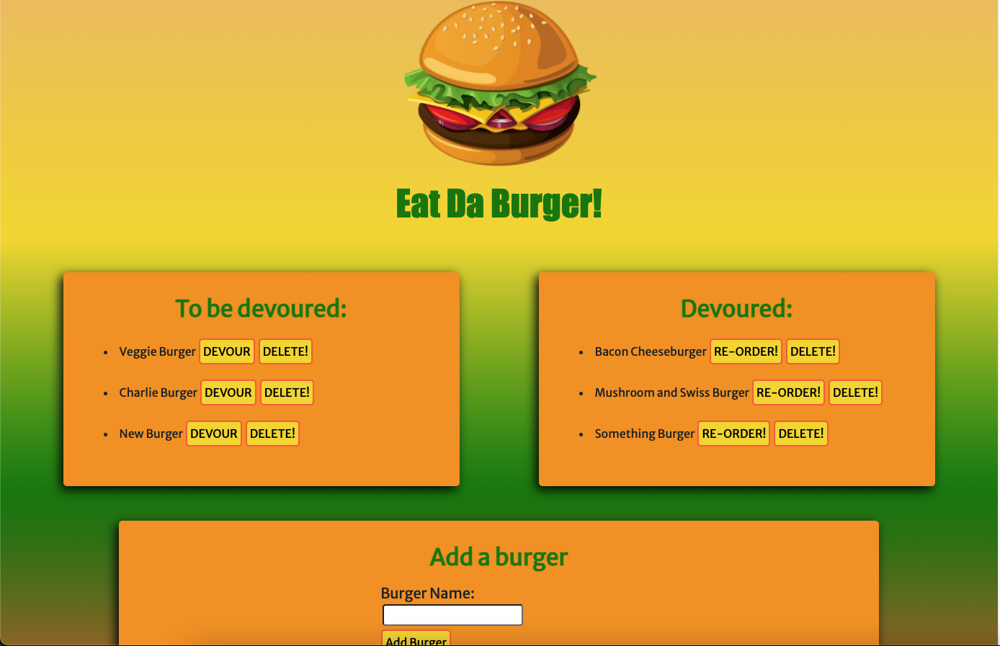

# Eat Da Burger!

## Description

Hungry? Decide what burger you would like to devour...

## Table of Contents

- [Installation](#installation)
- [Usage](#usage)
- [Deployed URL](#deployed-url)
- [Questions](#questions)
- [License](#license)

## Installation

Simply open the deployed Heroku application to begin!

## Usage

- Users may select the `DEVOUR` buttons from burgers in the 'To Be Devoured' column, which will send the burger they're craving to the 'Devoured' section.
- From there, if a user wishes to re-order the same burger for another round, they may do so by clicking the `RE-ORDER!` button.
- If a user would like to devour a burger not yet on the list, they may use the `'Add Burger'` form section to do so.
- At any given time, should a user become disgusted with a burger in either list, they may delete it using any of the attached `DELETE` buttons.

## Deployed URL
[https://eat-burgerlist-app.herokuapp.com/](https://eat-burgerlist-app.herokuapp.com/)

## Questions

If you have any questions, please contact jimbopulos at james.mgalantino@gmail.com

## License

This application is covered under the MIT license.

Copyright (c) 2021 James Galantino

Permission is hereby granted, free of charge, to any person obtaining a copy
of this software and associated documentation files (the "Software"), to deal
in the Software without restriction, including without limitation the rights
to use, copy, modify, merge, publish, distribute, sublicense, and/or sell
copies of the Software, and to permit persons to whom the Software is
furnished to do so, subject to the following conditions:

The above copyright notice and this permission notice shall be included in all
copies or substantial portions of the Software.

THE SOFTWARE IS PROVIDED "AS IS", WITHOUT WARRANTY OF ANY KIND, EXPRESS OR
IMPLIED, INCLUDING BUT NOT LIMITED TO THE WARRANTIES OF MERCHANTABILITY,
FITNESS FOR A PARTICULAR PURPOSE AND NONINFRINGEMENT. IN NO EVENT SHALL THE
AUTHORS OR COPYRIGHT HOLDERS BE LIABLE FOR ANY CLAIM, DAMAGES OR OTHER
LIABILITY, WHETHER IN AN ACTION OF CONTRACT, TORT OR OTHERWISE, ARISING FROM,
OUT OF OR IN CONNECTION WITH THE SOFTWARE OR THE USE OR OTHER DEALINGS IN THE
SOFTWARE.
